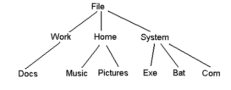
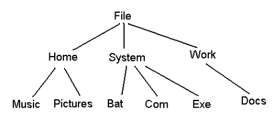

# GeneralTree-Data-Structures-Using-java

# Created by Osama Alsubaie

This repository contains projects and practice set for ICS-202 Data Structures course, this project will be developed using Java to design GeneralTree.

## Project Qustion and Requirments

PROJECT QUESTON

Write a class GeneralTree in java that models a GeneralTree. A GeneralTree has the following characteristics:

1.	Design and implement a class GeneralTreeNode<T extends Comparable<? super T>. Each GeneralTreeNode<T extends Comparable<? super T> contains a Comparable object of type T as its key.  

2.	A GeneralTree< T extends Comparable<? super T>> consists of GeneralTreeNodes. The maximum number of children for any node of a general tree is given by a constant MAXIMUM (fixed for the entire tree). The value of this MAXIMUM  is set to be 10, but can be changed. Each GeneralTreeNode may have MAXIMUM or fewer children.

3.	A GeneralTree supports the following operations: 

a.	constructor(GeneralTreeNode rootNode)
b.	void insert(GeneralTreeNode parentNode, GeneralTreeNode newNode), 
c.	String search(GeneralTreeNode newNode)  
//The String prints the path of the newNode starting with the rootNode
d.	void delete(GeneralTreeNode existingNode).
4.	A method sortByLevel(), which sorts each level of the GeneralTree according to Comparable.

For example, a GeneralTree of Strings is formed as follows:

 
Then after sortByLevel(), it becomes the following:

Include methods for traversing the GeneralTree, i.e. bfs, preorder and postorder 
[Note that inorder traversal is not defined].

Application:

Now apply the class GeneralTree to a folder structure, i.e. given a folder in your system as the base folder, your program will create a GeneralTree out of the entire folder structure. You may add a variable to your GeneralTreeNode class to indicate whether a name is a folder name or a file name.

Implement a GUI or menu based interface that supports the following operations:

1)	Given a root folder name, constructs the GeneralTree for the entire set of files and folders contained within it.
2)	Searches for and prints the path to a given filename.
3)	Prints the tree in bfs, preorder or postorder.
4)	Sorts the GeneralTree and prints it as mentioned above.
5)	Prints the number of files and number of folders in the tree.

Assume that all filenames and folder names are unique and that each folder contains no more than MAXIMUM number of files. 

